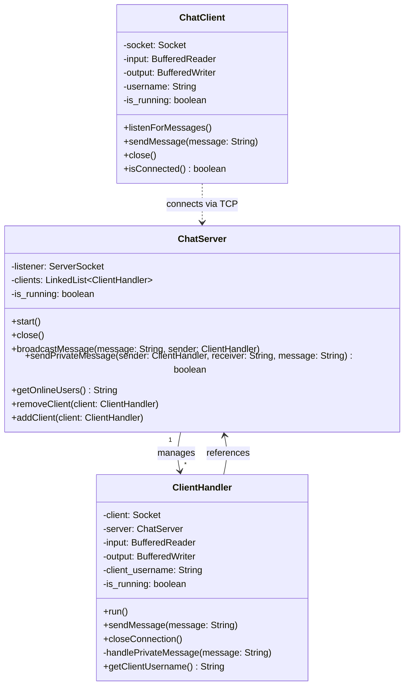

# Multithreaded Chat Server and Client in Java

## Contents

- [Overview](#overview)
- [Class Diagram](#class-diagram)
- [How to Run](#how-to-run)
- [Commands](#commands)
- [Troubleshooting](#troubleshooting) 

## Overview

A multi-user chat application built with Java. Clients connect to a central server over TCP sockets and can broadcast messages or send private messages to specific users.

**Features:**
- Concurrent multi-client connections via multithreading
- Broadcast messaging to all connected users
- Private messaging between specific users
- Online user listing
- Automatic anonymous username assignment for unnamed clients
- Graceful connection and disconnection handling

## Class Diagram



**Design Highlights:**
- **Multithreaded** — each client connection is handled in its own thread via `ClientHandler implements Runnable`
- **Separation of Concerns** — server logic, client logic, and per-connection handling are cleanly separated into distinct classes
- **Thread Safety** — shared client list operations are `synchronized` to prevent race conditions
- **Graceful Shutdown** — resources (sockets, streams) are properly closed on disconnect or error

**Notes:**
- `ChatServer` listens on port `8080` by default and spawns a new `ClientHandler` thread for each accepted connection.
- `ClientHandler` reads the client's username on initialization and broadcasts join/leave events to all other clients.
- `ChatClient` runs a dedicated listener thread to receive messages asynchronously while the main thread handles user input.

## How to Run

> **Prerequisites**: Java 8 or higher

**1. Clone the repo and navigate to it**
```bash
git clone https://github.com/your-username/multi-client-chat.git
cd multi-client-chat/src
```

**2. Start the server**
```bash
java ChatServer.java
```

**3. Start a client** (in a separate terminal)
```bash
java ChatClient.java
```

When prompted, enter the server IP (or press Enter for `localhost`) and choose a username.

> **Tip:** You can also compile first with `javac *.java` and then run with `java ChatServer` / `java ChatClient`.

## Commands

| Command | Description |
|---|---|
| `/msg "username" <message>` | Send a private message to a specific user |
| `/list` | Display all currently online users |
| `/exit` | Disconnect from the chat server |

## Troubleshooting

| Problem | Solution |
|---|---|
| `Address already in use` | Port 8080 is occupied. Stop the other process or change the port in `ChatServer.java`. |
| `Connection refused` | Make sure the server is running before starting clients. Check firewall settings. |
| Can't connect remotely | Verify the server's IP address and ensure no network restrictions are blocking port 8080. |

## License

This project is open source and available under the [MIT License](LICENSE).
